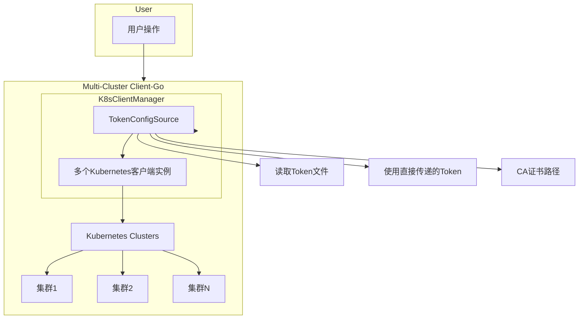

# Multi-Cluster Client-Go

`multi-cluster-clientgo` 是一个用于管理和操作多个 Kubernetes 集群的 Golang 应用程序。它使用 `client-go` 库，通过配置不同的集群连接信息（包括 API Server URL、Token 和 CA 证书），实现对多个 Kubernetes 集群的管理。

## 目录结构

multi-cluster-clientgo/

├── cmd/

│ └── main.go # 入口文件，主要逻辑

├── internal/

│ ├── manager/

│ │ ├── client_manager.go # 管理多个 Kubernetes 客户端

│ │ └── client_manager_test.go # 测试文件

│ └── config/

│ ├── config_source.go # K8sConfigSource 接口定义

│ ├── token_config_source.go # TokenConfigSource 实现

│ └── config_source_test.go # 测试文件

└── go.mod # Go module 文件


## 功能

- 支持通过 Token 或 Token 文件连接多个 Kubernetes 集群。
- 可选地通过 CA 证书验证 API Server 的 TLS 证书。
- 支持配置 `Insecure` 模式来忽略 TLS 证书验证。
- 可自定义实现GetConfig()，定义了从不同来源获取 Kubernetes 连接配置的方法
- 集群初始化所需的token，用户可自定义从任何来源（配置文件，secret、数据库）获取，只需要封装成TokenConfigSource即可
- 支持更新集群token配置

### 解释

- **User**: 代表使用该项目的用户，用户通过项目执行对 Kubernetes 集群的操作（如列出 Pods）。

- **Multi-Cluster Client-Go**: 项目的主模块，负责处理用户操作并与多个 Kubernetes 集群交互。

- **K8sClientManager**:
  - **TokenConfigSource**: 提供集群连接所需的配置信息，包括 API Server URL、Token、CA 证书路径等。
  - **多个 Kubernetes 客户端实例**: `K8sClientManager` 管理多个 Kubernetes 客户端，每个客户端对应一个集群。

- **Kubernetes Clusters**:
  - **集群1、集群2、集群N**: 用户通过项目连接的多个 Kubernetes 集群。

- **TokenConfigSource**:
  - **读取Token文件**: 从文件中读取 Token 以连接集群。
  - **使用直接传递的Token**: 直接使用用户提供的 Token 以连接集群。
  - **CA证书路径**: 如果需要验证集群 API Server 的证书，使用指定的 CA 证书。

## 项目架构



## 安装

1. 克隆代码库：

   ```bash
   git clone https://github.com/yourusername/multi-cluster-clientgo.git
   cd multi-cluster-clientgo

2. 安装依赖：

```
go mod tidy
```

## 配置和运行

### 配置

在 `main.go` 中定义了多个集群的配置信息。每个集群需要提供以下信息：

- `Name`：集群的标识名称。
- `APIServerURL`：集群的 API Server 的 URL。
- `Token`：直接传递的 Token 字符串（可选）。
- `TokenPath`：Token 文件的路径（可选）。
- `Insecure`：是否忽略 TLS 证书验证（布尔值）。
- `CACertPath`：CA 证书文件的路径（当 `Insecure` 为 `false` 时必须提供）。

```
#生成token
SECRET_NAME=$(kubectl get sa multer-sa -o jsonpath='{.secrets[0].name}' -n default)
kubectl get secret $SECRET_NAME -o jsonpath='{.data.token}' -n default | base64 --decode
#保存token为文件
kubectl get secret $SECRET_NAME -o jsonpath='{.data.token}' -n default | base64 --decode > token.txt
#获取证书
cat ~/.kube/config | awk '/certificate-authority-data:/{print $2}' | base64 --decode > ca.crt
```


### 示例配置

以下是 `main.go` 中的示例配置：

```
package main

import (
	"context"
	"fmt"
	"log"
	"multi-cluster-clientgo/internal/config"
	"multi-cluster-clientgo/internal/manager"
	metav1 "k8s.io/apimachinery/pkg/apis/meta/v1"
)

func main() {
	// 假设我们有多个集群的配置信息
	clusters := []struct {
		Name         string
		APIServerURL string
		Token        string
		TokenPath    string
		Insecure     bool
		CACertPath   string // CA 证书路径
	}{
		{
			Name:         "cluster1",
			APIServerURL: "https://10.19.225.29:6443",
			TokenPath:    "path/to/cluster1-token.txt",
			Insecure:     true,
		},
		{
			Name:         "cluster2",
			APIServerURL: "https://10.19.225.30:6443",
			Token:        "your-token-here", // 直接传递 Token
			Insecure:     false,
			CACertPath:   "path/to/cluster2-ca.crt",
		},
	}

	// 创建一个 K8sClientManager 实例
	clientManager := manager.NewK8sClientManager()

	// 为每个集群创建一个 TokenConfigSource 并添加到 K8sClientManager 中
	for _, cluster := range clusters {
		var tokenSource config.K8sConfigSource
		if cluster.Token != "" {
			tokenSource = config.NewTokenConfigSourceWithToken(cluster.APIServerURL, cluster.Token, cluster.Insecure, cluster.CACertPath)
		} else if cluster.TokenPath != "" {
			tokenSource = config.NewTokenConfigSourceWithFile(cluster.APIServerURL, cluster.TokenPath, cluster.Insecure, cluster.CACertPath)
		} else {
			log.Fatalf("No token or tokenPath provided for cluster %s", cluster.Name)
		}

		if err := clientManager.AddClient(cluster.Name, tokenSource); err != nil {
			log.Fatalf("Failed to add %s: %v", cluster.Name, err)
		}
	}

	// 示例操作：获取并列出每个集群的 namespaces
	for _, cluster := range clusters {
		client, err := clientManager.GetClient(cluster.Name)
		if err != nil {
			log.Fatalf("Failed to get client for %s: %v", cluster.Name, err)
		}

		// 获取所有命名空间中的所有 Pod 名称
		pods, err := client.CoreV1().Pods("").List(context.TODO(), metav1.ListOptions{})
		if err != nil {
			log.Fatalf("Failed to list pods: %v", err)
		}

		for _, pod := range pods.Items {
			fmt.Printf("Pod Name: %s, Namespace: %s\n", pod.Name, pod.Namespace)
		}
	}

	// 优雅关闭所有客户端
	clientManager.Shutdown()
}

```

### 运行

配置好集群信息后，运行程序：

```
go run cmd/main.go
```

程序将根据配置的集群信息连接多个 Kubernetes 集群，列出每个集群中的 Pods，并打印出 Pod 名称和命名空间。

## 测试

本项目包含单元测试文件，位于 `internal/config/config_source_test.go` 和 `internal/manager/client_manager_test.go`。

运行测试命令：

```
go test ./internal/...
```

## 注意事项

- 请确保为每个集群配置正确的 `Token` 或 `TokenPath`，以及在 `Insecure` 为 `false` 时提供有效的 `CACertPath`。
- 如果连接 Kubernetes 集群时出现 `tls: failed to verify certificate` 错误，请确认提供的 CA 证书是正确的，且路径有效。

## 贡献

欢迎提交 issues 和 pull requests 来改进此项目。如果你有任何问题或建议，请在 GitHub 上与我们联系。

## 许可证

此项目在 MIT 许可证下发布。详情请参阅 LICENSE 文件。
